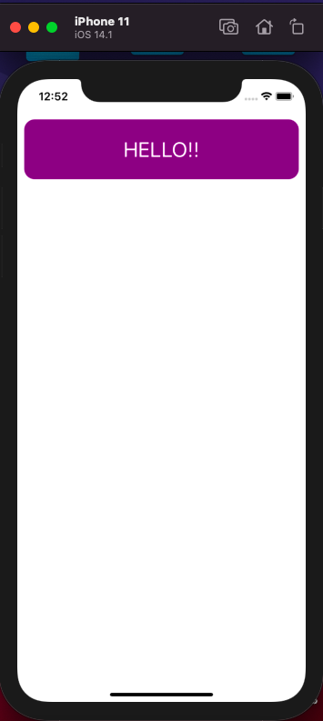
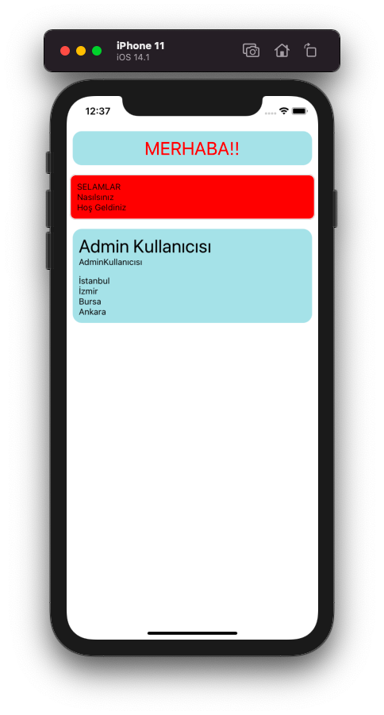
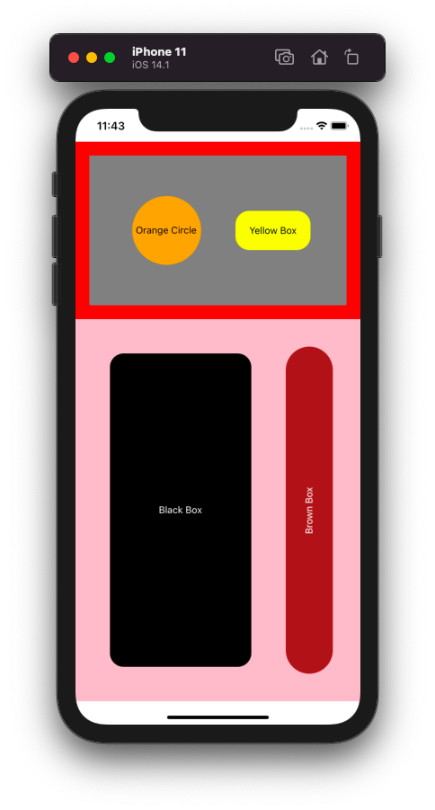
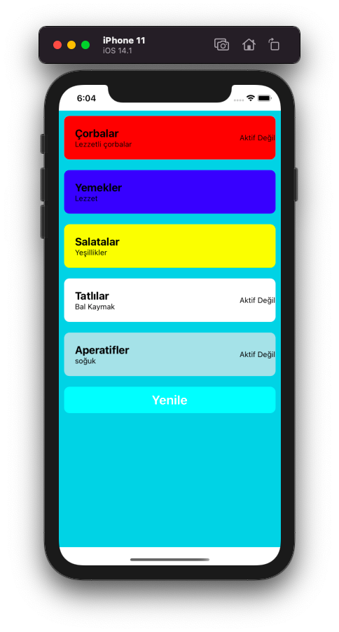
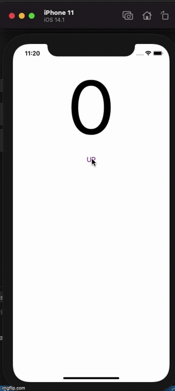
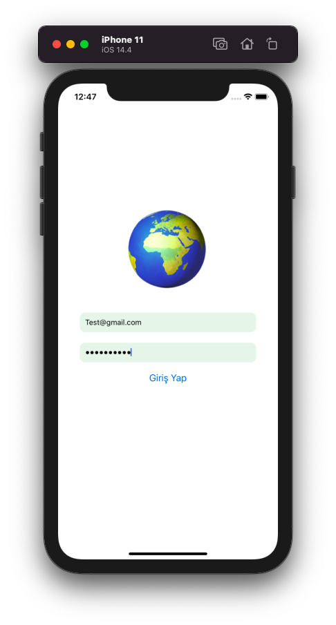

# React-Native-Examples
This repository contains basic example of React-Native. 
1) Simple React Native example (Hello Page).
2) Simple custom component structure.
3) Flex style samples.
4) Passing props to a component.
5) Counter example.Using Alert component on React-Native and using useState, useEffect, Button components.
6) Email and Password entering page example. This app has Email validation function. 

  

  

  

  

