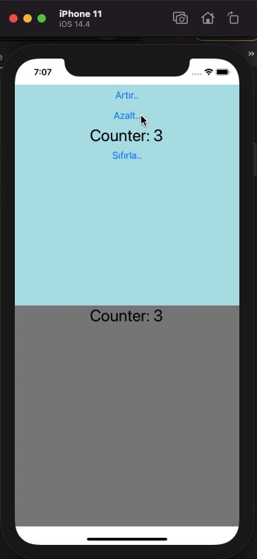

# React-Native-Examples
This repository contains basic example of React-Native. 
1) Simple React Native example (Hello Page).
2) Simple custom component structure.
3) Flex style samples.
4) Passing props to a component.
5) Counter example.Using Alert component on React-Native and using useState, useEffect, Button components.
6) Email and Password entering page example. This app has Email validation function. 
7) Using global state by Redux. we can do simple counter on different components using redux.(without using props pass)

  

  

  
  

  

